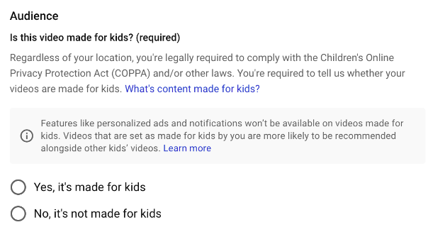

# Social media guide

We aim to create content that encourages interaction, participation, and conversation.
When posting to social media under Operate First, be sure to:
* Ensure content is accurate
* Proofread the post carefully
* Provide links to related pages or resources
* Verify that your links work
* Request review on the content and gain approval before posting
* Adhere to the Red Hat [Social Media Guidelines][1] and [Style Guide][2]

## General goals

1. Raise awareness on the Operate First initiative
1. Grow the community of users and contributors
1. Increase interaction and dialogue within the community
1. Drive traffic to the website

### Metrics

A variety of metrics can be used to measure the effectiveness of social media efforts for Operate First.

#### Universal
* Website traffic from social media
* Likes
* Comments
* Posting cadence

#### Twitter
* Followers
* Mentions
* Retweets

#### Youtube
* Subscribers
* Views

## Twitter guidance

Tweets for [Operate First][3] are written collaboratively and posted via the merging of pull requests to the twitter repository.
Visit [this page][4] for instructions on writing and posting tweets.

Ideally, a tweet should be posted for each Operate First Youtube video promoting that content.
Twitter can also be used to promote Operate First in general and provide updates on the initiative to the community.

When writing copy for a tweet, tag people and software accounts directly for better reach.
For example, use @trinodb in your tweet rather than Trino.

Don’t overuse hashtags. One or two is sufficient, more may trigger algorithms to work against your tweet being highlighted.

## Youtube guidance

### Title

The title should capture the overall subject of the video using as few words as possible.
Think descriptive, simple, and brief.
Previously, video titles have not capitalized in a consistent way and switch between sentence case and title case.
Moving forward, use the title case for all Youtube videos in order to establish consistency.

### Description

The description should provide an initial summary that describes the content of the video itself; this summary should be clear and concise.
Next, share links or resources of any kind that are related and relevant to the video.
Additionally, provide a way of contacting the creator(s) or other Operate First experts to ask questions or start a dialogue.

#### Description template

>In this video, we will ...
>
>Related links:
> * Any specific repos, pages, guides or tutorials, etc
> * [Operate First Website][5]
> * [Operate First GitHub organization][6]
>
>Questions? Contact us in [slack][7] or leave a comment on this video!
>
>Subscribe down below, and check us out on [Twitter][3] to keep up with all things Operate First.

### Audience

Since children are not the primary audience for Operate First videos, mark videos not made for kids.

[1]: https://source.redhat.com/groups/public/social-media-at-red-hat/social_guidelines_nav
[2]: https://source.redhat.com/groups/public/social-media-at-red-hat/social_guidelines_nav/social_media_style_guide
[3]: https://twitter.com/OperateFirst
[4]: https://github.com/operate-first/operate-first-twitter/blob/main/tweets/README.md
[5]: https://www.operate-first.cloud/
[6]: https://github.com/operate-first
[7]: https://join.slack.com/t/operatefirst/shared_invite/zt-o2gn4wn8-O39g7sthTAuPCvaCNRnLww
